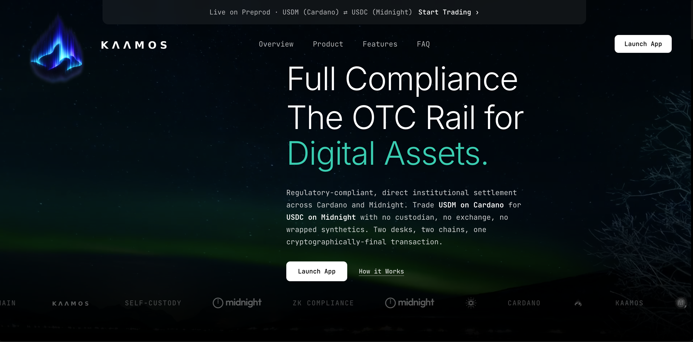

<p align="center">
  
</p>

<h1 align="center">Kaamos</h1>

<p align="center">
  Trustless cross-chain OTC settlement between Cardano and Midnight via hash-time-locked escrow.
</p>

<p align="center">
  <a href="https://midnight.finance">Live Demo</a>
  &nbsp;·&nbsp;
  <a href="#quick-start">Run locally</a>
  &nbsp;·&nbsp;
  <a href="#architecture">Architecture</a>
</p>

<p align="center">
  
</p>

---

> [!WARNING]
> Please use the **1AM preprod wallet** for Midnight and the **Lace preprod wallet** for Cardano, and disable **gas sponsorship** on the 1AM wallet some features may not work otherwise. Contracts are compiled with the **Compact compiler `0.30.0`** (language `0.22.0`, runtime `0.15.0`).

## Problem

Two parties on different chains want to swap assets atomically say USDM on Cardano for USDC on Midnight. The available options are bad:

- **Custodial desks** reintroduce counterparty risk and break self-custody.
- **Bridges** require trust in operators, multisigs, or relayers and have a long history of nine-figure exploits.
- **Manual "you send first"** coordination puts whichever party moves second at the mercy of the first.

There is no shared ledger between Cardano and Midnight, so neither chain can directly observe the other. We need a settlement primitive where both legs commit or both legs unwind, with no third party holding funds.

## Solution

Kaamos settles cross-chain trades using [**hash-time-locked contracts (HTLCs)**](https://www.youtube.com/watch?v=VvEaBeiteLI) deployed natively on each chain, both bound to the same SHA-256 preimage. Revealing the preimage to claim on one chain mathematically forces the same reveal on the other. If either party walks away, both legs refund automatically when their timelocks expire.

The current preprod build settles **USDM (Cardano)** ⇄ **USDC (Midnight)** in either direction, with an institutional RFQ surface on top public order book, quote/counter/accept negotiation, and per-deal wallet binding. The orchestrator is an indexer for UX and observability; chain state is authoritative.

> [!NOTE]
> We wanted **shielded USDC** to keep deal sizes and counterparties confidential, but Compact can't atomically lock a balance-map shielded fungible (the OZ `FungibleToken` pattern) from a separate HTLC contract. So USDC is a **native Zswap unshielded** token: the HTLC custodies it via `receiveUnshielded(...)` in one circuit, no cross-contract call needed.

## Deployed contracts (preprod)

| Chain | Contract | Address |
|---|---|---|
| Cardano | HTLC validator script | [`addr_test1wqnjap…v798e`](https://preprod.cardanoscan.io/address/addr_test1wqnjaplx5fswjr0ja7l2uuv890058f5qkak6cmdpqx8fn3q5v798e) |
| Cardano | USDM minting policy | [`def68337…77088ea`](https://preprod.cardanoscan.io/tokenPolicy/def68337867cb4f1f95b6b811fedbfcdd7780d10a95cc072077088ea) (asset name `USDM`) |
| Midnight | HTLC contract | `5a3fc37f04c3c5bb2e957da34dfa989b9eb21513889c9dd438d000918279b457` |
| Midnight | USDC token contract | `a949ee48c3078ffc7efa829b4837d1554ea4f36775853baeedf3dd86e1d27b5e` |


## How HTLCs are used

A hash-time-locked contract holds funds under a disjunction:

1. **Hash-lock branch** — the receiver claims by revealing a `preimage` such that `SHA256(preimage) == hash`.
2. **Time-lock branch** — after `deadline`, the original sender reclaims.

For a maker `M` who wants USDC on Midnight in exchange for USDM on Cardano, the forward flow is:

```
1. M generates a random 32-byte secret  s   and computes  h = SHA256(s).

2. M locks USDM on Cardano:
       claimable by T  with s  before  T_long   (≈ 4h)
       reclaimable by M        after   T_long

3. T sees the Cardano lock (filtered by hash, receiver-PKH, deadline > now)
   and locks USDC on Midnight:
       claimable by M  with s  before  T_short  (≈ 2h)
       reclaimable by T        after   T_short

       T_short < T_long  with a safety buffer so the preimage that lands
       on Midnight at T_short still has runway on Cardano until T_long.

4. M claims USDC on Midnight by submitting s. The Compact contract writes
   s into  revealedPreimages[h] — public ledger state.

5. T reads s from Midnight and claims USDM on Cardano.
```

The asymmetric, **nested** deadlines are load-bearing. If `T_short ≥ T_long`, the maker could stall until the taker's window had closed but the maker's hadn't, claim USDC at the last moment, then reclaim USDM via the time-lock branch — taker loses both legs. With `T_short < T_long`, any preimage reveal in time to claim USDC necessarily leaves the taker time to claim USDM.

The reverse direction (`usdc-usdm`) is the mirror image: the maker deposits on Midnight first, the taker locks on Cardano second, and the preimage is revealed inside the **Cardano spend redeemer** when the maker claims USDM. The taker recovers it via Blockfrost (`/txs/:hash/redeemers`) or the orchestrator's fast-path relay.

SHA-256 was picked because Compact's `persistentHash<Bytes<32>>` and Plutus V3's `sha2_256` produce the same digest for the same 32 bytes — no encoding adapters, no curve crossover.

**Where the preimage lives** at each stage:

- **Maker's `localStorage`** — between lock and claim, so a tab reload can resume the claim. 
- **Midnight `revealedPreimages` map** — `Map<Bytes<32>, Bytes<32>>` ledger state written by the Compact circuit on a forward-direction claim; indexable by hash.
- **Cardano spend redeemer** — the `Withdraw{preimage}` argument of the maker's spend tx on a reverse-direction claim; recovered via Blockfrost `/txs/:hash/redeemers`.
- **Orchestrator `swaps.midnight_preimage` (SQLite)** — advisory fast-path cache populated by the maker and the Cardano watcher. The chain reveal is authoritative; the cache is a UX speedup.

## Settlement flow

Zooming out from the cryptographic mechanism, here is how a deal moves through Kaamos end-to-end. Both trade directions follow the same HTLC pattern; only which chain locks first changes.

### OTC RFQ flow

1. **Originator creates an RFQ** with a side, sell amount, indicative buy amount, and expiry.
2. **Liquidity providers submit quotes** against the RFQ, each carrying a per-deal receive-side wallet snapshot.
3. **Originator accepts a quote**, freezing the negotiated terms and the counterparty's wallet snapshot.
4. **Settlement starts** — the accepted RFQ bridges into the atomic-swap flow via a single `rfqId` field on swap creation.
5. **Activity and notifications** track RFQ, quote, and settlement lifecycle events for both sides.

### Atomic swap flow

The protocol traced above, restated as the operator sees it:

1. **Maker commits first.** The initiating party locks or deposits on the first chain.
2. **Taker commits second.** The counterparty locks or deposits on the other chain against the same hash.
3. **Claim reveals the preimage.** The first successful claim publishes the secret on its chain.
4. **Counterparty claims with the same preimage.** This completes both sides of the swap.
5. **Refunds are available after expiry.** If the flow stalls, each side can reclaim from its own chain after its timelock.

### Safety model

- **Hashlock:** funds can only be claimed with the correct SHA-256 preimage.
- **Timelock:** funds can be reclaimed after the deadline if settlement does not complete.
- **Native execution:** Cardano and Midnight assets settle on their own chains; nothing crosses a bridge.
- **Orchestrator is not custody:** it stores RFQs, metadata, and observed chain state — never funds or private keys.

## Architecture

```
┌─────────────────────────────┐         ┌─────────────────────────────┐
│  htlc-ui (Vite / React)     │  REST   │  htlc-orchestrator          │
│  • OTC order book + RFQ     │◀──────▶│  (Fastify + better-sqlite3) │
│  • Swap state machines      │         │  • RFQ / quote / activity   │
│  • Two-wallet bind          │         │  • Chain watchers (advisory)│
│    (1AM Midnight + Lace)    │         │  • Supabase JWT verifier    │
└──────────┬──────────────────┘         └──────┬──────────────────────┘
           │ wallet-signed txs                 │ Blockfrost / Midnight indexer
           ▼                                   ▼
   ┌──────────────────────┐           ┌──────────────────────┐
   │  Midnight preprod    │           │  Cardano preprod     │
   │  • htlc.compact      │           │  • htlc.ak (Aiken)   │
   │  • usdc.compact      │           │  • usdm.ak (Aiken)   │
   └──────────────────────┘           └──────────────────────┘
```

Two layers stacked in one repo:

- **Layer 1 — atomic-swap protocol.** Compact + Aiken contracts, browser reducers (`useMakerFlow`, `useTakerFlow`, and reverse variants), watchers. Settlement safety lives here. Works without the orchestrator.
- **Layer 2 — OTC desk.** Authenticated RFQ surface with per-deal wallet snapshots captured at quote time. The bridge into Layer 1 is a single optional `rfqId` field on swap creation; the maker's lock call is otherwise unchanged.

`acceptQuote` deliberately does **not** synthesise a swap row. That would require a preimage hash before the maker has signed anything, which would either move secret generation into the orchestrator (breaking chain authority) or weaken watcher invariants. Swap rows are only ever created when the maker actually locks funds.

## Quick start

Requires Node 22+, the [Aiken](https://aiken-lang.org) toolchain, the Compact compiler, a Midnight proof server at `127.0.0.1:6300`, and Lace (Midnight + Cardano) or Lace (Midnight) + Eternl (Cardano) on preprod.

```bash
# 1. Compile contracts and run one-time deployment
cd contract && npm run compact:htlc && npm run compact:usdc && npm run build:all
cd ../cardano && aiken build
cd ../htlc-ft-cli && \
  BLOCKFROST_API_KEY=$BLOCKFROST_API_KEY MIDNIGHT_NETWORK=preprod \
  npx tsx src/setup-contract.ts
cp swap-state.json ../htlc-ui/swap-state.json

# 2. Orchestrator (auto-loads .env, Node 22+)
cd ../htlc-orchestrator && npm install && npm run dev

# 3. UI
cd ../htlc-ui && npm install && npm run dev
```

Environment files:

- `htlc-ui/.env.preprod` — tracked; public-ish keys only (Blockfrost preprod, indexer URLs).
- `htlc-ui/.env.local` — gitignored; holds `VITE_SUPABASE_*`.
- `htlc-orchestrator/.env` — gitignored; holds `SUPABASE_SERVICE_ROLE_KEY`. Never ship to clients.

Forward-flow CLI regression (no UI, no wallets):

```bash
npx tsx htlc-ft-cli/src/execute-swap.ts
```

## Status

Preprod hackathon build. Both flow directions are end-to-end verified in two-browser settlement against preprod nodes. Not audited.

Before mainnet:

- Independent contract review of `htlc.compact`, `usdc.compact`, `htlc.ak`, `usdm.ak`.
- Access control on USDC and USDM mint policies (currently permissionless for the faucet).
- Blockfrost proxy + provider redundancy; same for Midnight indexer.
- Persistence migration from SQLite to Postgres; leader-elected watcher for HA.
- Wallet-derived encryption for the locally-cached preimage.
- Production observability and stuck-swap alerting beyond the current heuristic.

## License

MIT. See `LICENSE`.
